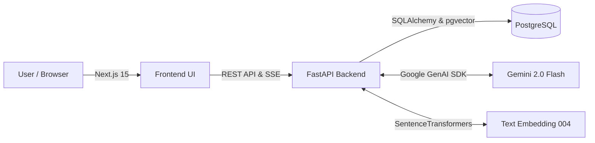

# FightIQ 🥊

> An enterprise-grade, Generative AI platform for UFC and MMA knowledge. Built with FastAPI, Next.js, pgvector, and Gemini 2.0 Flash.

FightIQ is a fully typed, end-to-end Retrieval-Augmented Generation (RAG) platform. It allows users to ingest complex MMA rulebooks, fighter histories, and event stats into a vector database, and leverages Gemini 2.0 to power an interactive Chat Interface and a dynamic Quiz Generation Engine.

---

## Features

- **Document Ingestion Engine**: Seamlessly parse and chunk Markdown, PDF, or text files.
- **Web Scraping**: Instantly vectorize knowledge from Wikipedia or other MMA domains.
- **Generative Quizzes**: Dynamically generate quizzes tailored by topic and difficulty, evaluated in real-time by an LLM with explanations.
- **RAG Chat**: Real-time SSE streaming chat with source attributions.
- **Objective Evaluation**: Built-in `ragas` pipeline to monitor Faithfulness, Relevancy, Precision, and Recall.
- **Enterprise UI**: Premium Next.js 15 interface featuring Tailwind v4, Shadcn UI, and strict TypeScript compliance.

## Architecture



## Quick Start (Docker Compose)

The easiest way to run the entire stack (Frontend, Backend, and PostgreSQL with pgvector) is via Docker.

### Prerequisites
- Docker & Docker Compose installed.
- A Google API Key with access to Gemini 2.0 Flash.

### 1. Configure Environment
Create a `.env` file in the root directory:
```env
GOOGLE_API_KEY=your_google_api_key_here
POSTGRES_USER=fightiq
POSTGRES_PASSWORD=fightiq_secret
POSTGRES_DB=fightiq
```

### 2. Launch the Stack
Run the following command to build the production images and start the services:
```bash
docker-compose up -d --build
```

### 3. Access the Application
- **Frontend UI**: http://localhost:3000
- **Backend API Docs**: http://localhost:8000/docs
- **Database**: `localhost:5432`

*Note: On first startup, the backend will automatically run Alembic migrations to configure the pgvector tables.*

## Development Setup

If you wish to develop locally without Docker containers for the applications:

### Backend
Powered by [uv](https://github.com/astral-sh/uv).
```bash
cd backend
uv venv
source .venv/bin/activate
uv pip install -e ".[dev]"
alembic upgrade head
uvicorn app.main:app --reload
```

### Frontend
Powered by Next.js and npm.
```bash
cd frontend
npm install
npm run dev
```

## Tech Stack
- **Frontend**: Next.js 15 (App Router), React 19, TypeScript, Tailwind CSS v4, shadcn/ui.
- **Backend**: FastAPI, Python 3.12, Pydantic, SQLAlchemy, Alembic, uv.
- **Database**: PostgreSQL 17 + pgvector.
- **AI Models**: Google `gemini-2.0-flash` (Generation) & `text-embedding-004` (Embeddings).
- **RAG Eval**: Ragas (Faithfulness, Answer Relevancy).


# UFC Stats CSV Structures

This document outlines the column headers for all 6 CSV files provided by the `Greco1899/scrape_ufc_stats` GitHub repository. These files are the raw scraped data from UFCStats.com.

## 1. ufc_event_details.csv
Contains the basic metadata for every UFC event.
```csv
EVENT,URL,DATE,LOCATION
```
- **EVENT**: Event name (e.g., "UFC 294: Makhachev vs. Volkanovski 2")
- **URL**: UFCStats event URL
- **DATE**: Date of the event
- **LOCATION**: Venue / City

---

## 2. ufc_fighter_details.csv
Contains basic mapping between fighter names and their URLs.
```csv
FIRST,LAST,NICKNAME,URL
```

---

## 3. ufc_fighter_tott.csv
Contains the "Tale of the Tape" (physical attributes) for each fighter.
```csv
FIGHTER,HEIGHT,WEIGHT,REACH,STANCE,DOB,URL
```
- **FIGHTER**: Full name
- **DOB**: Date of birth

---

## 4. ufc_fight_results.csv
Contains the high-level results and outcomes of every fight.
```csv
EVENT,BOUT,OUTCOME,WEIGHTCLASS,METHOD,ROUND,TIME,TIME FORMAT,REFEREE,DETAILS,URL
```
- **BOUT**: The fight matchup (e.g., "Islam Makhachev vs. Alexander Volkanovski")
- **OUTCOME**: W/L/D/NC
- **DETAILS**: Often contains bonuses like "Performance of the Night" or point deductions.

---

## 5. ufc_fight_details.csv
Provides the URL linking to the detailed round-by-round statistics for a specific fight.
```csv
EVENT,BOUT,URL
```

---

## 6. ufc_fight_stats.csv 
*(The missing piece)* Contains the highly detailed, round-by-round combat statistics for every fighter in every fight.
```csv
EVENT,BOUT,ROUND,FIGHTER,KD,SIG.STR.,SIG.STR. %,TOTAL STR.,TD,TD %,SUB.ATT,REV.,CTRL,HEAD,BODY,LEG,DISTANCE,CLINCH,GROUND
```
- **ROUND**: Round number
- **KD**: Knockdowns
- **SIG.STR.**: Significant strikes (Landed of Attempted)
- **TD**: Takedowns (Landed of Attempted)
- **SUB.ATT**: Submission attempts
- **CTRL**: Control time

> [!NOTE]
> `ufc_fight_stats.csv` is the file required to dynamically compute the 8 advanced metrics (`slpm`, `str_acc`, `sapm`, `str_def`, `td_avg`, `td_acc`, `td_def`, `sub_avg`) that are currently NULL in our database.
